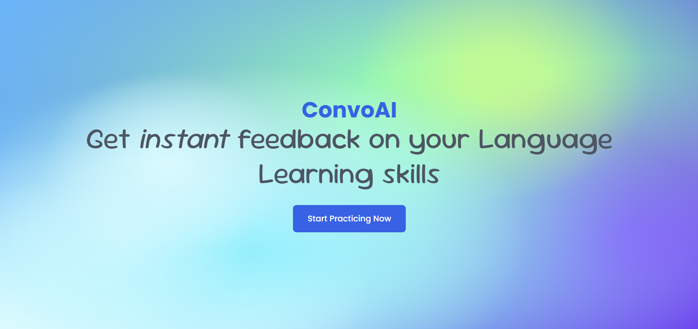
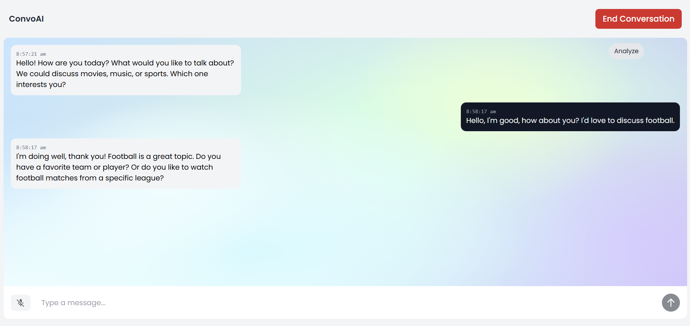
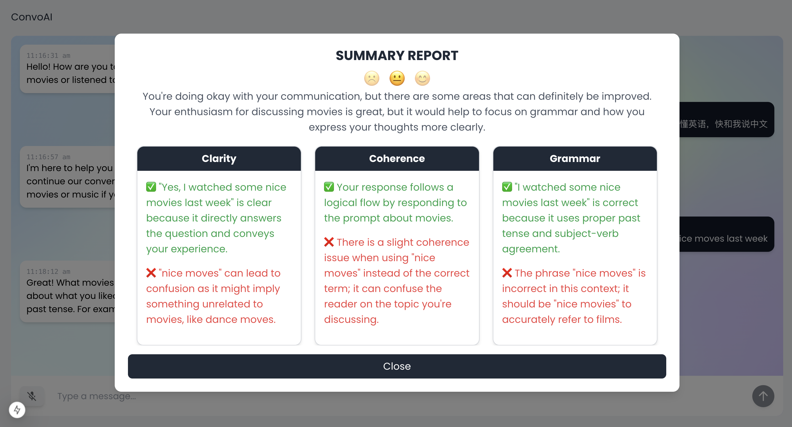

# Team39-ConvoAI

A multimodal agentic AI language learning assistant.

## Our UI

## 🚀 Features
- **Multimodal + Multi-Language Conversations**  
  Voice + text interactions with real-time translation support
- **AI Agent**  
  Pre-built specialists for language learning
- **Conversation Analytics**  
  Post-chat breakdown with fluency scoring and improvement tips 

## ⚡️ Highlights
- `3s` cold start for voice interactions
- `200ms` median audio latency via WebRTC optimizations
- `97%` transcription accuracy across 15+ languages

## 🛠 Tech Stack
- **Core AI**  
  GPT-4o + Whisper v3 + Realtime API
- **Frontend**  
  React 18, Real-time transcript rendering 
- **Analytics**  
  Conversation insights engine with Zod validation 
